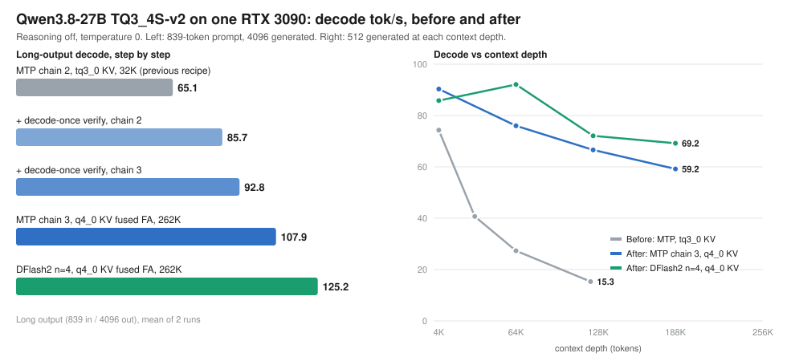

# Qwen3.8 27B TQ3_4S (v2) speculative decode recipe for RTX 3090

**125 tok/s** long-output decode for a 27B model on a single RTX 3090 24 GB, with the full 262K context,
using the TQ3_4S v2 weights, a DFlash2 drafter and a 4-bit KV cache. Up from 65 tok/s in the previous
version of this recipe.



## What changed since the previous recipe

| Step | Change | Long-output decode |
| --- | --- | ---: |
| previous recipe | MTP fused chain 2, tq3_0 KV, 32K (llama.cpp-tq3#89) | 65.1 tok/s |
| 1 | decode-once verify: TQ3_4S / Q6_K weights unpacked once per verify pass, not once per draft token (#90) | 85.7 tok/s |
| 2 | MTP chain depth 3 (depth 4 is slower: 88.7) | 92.8 tok/s |
| 3 | q4_0 KV cache with fused-dequant flash attention and GQA packing (#90), 262K context | 107.9 tok/s |
| 4 | DFlash2 drafter (n=4) instead of the built-in MTP head | **125.2 tok/s** |

Long-output protocol ([`card_bench.py`](card_bench.py)): chat endpoint, reasoning off, 839-token prompt,
4096 generated tokens, `temperature=0`, 1 warmup + 2 measured runs. Raw runs:
[`results/card-protocol-2026-09-26.jsonl`](results/card-protocol-2026-09-26.jsonl).

| Config | Mean | Run 1 | Run 2 | Draft acceptance |
| --- | ---: | ---: | ---: | ---: |
| **DFlash2 n=4, q4_0 KV, 262K** | **125.23** | 124.97 | 125.49 | 81.2% |
| MTP chain 3, q4_0 KV, 262K | 107.91 | 107.87 | 107.95 | 76.9% |

### Decode vs context depth

512 generated tokens on a code-refactor prompt at each depth, greedy, reasoning off.

| Context depth | 4K | 64K | 124K | 188K |
| --- | ---: | ---: | ---: | ---: |
| **DFlash2 n=4, q4_0 KV** | 85.8 | **92.1** | **72.1** | **69.2** |
| MTP chain 3, q4_0 KV | **90.3** | 76.0 | 66.6 | 59.2 |
| Before: MTP, tq3_0 KV* | 74.3 | 27.3 (64K) | 15.3 (122K) | - |

\* The tq3_0 "before" curve was measured on a second RTX 3090 that runs ~3-15% slower; its steep fall
comes from the tq3_0 KV attention path, which the q4_0 fused path replaces.

With reasoning on, expect lower tok/s on thinking-heavy answers (the drafter accepts fewer tokens).
Cap thinking with `--reasoning-budget 8192` if you enable it; without a cap a stuck answer can run
until the context fills.

## Requirements

- NVIDIA RTX 3090 24 GB (uses ~21.4 GB at 262K with the DFlash2 drafter)
- CUDA 13.0 build targeting `sm_86`
- [turbo-tan/llama.cpp-tq3](https://github.com/turbo-tan/llama.cpp-tq3) `main` at or after `45efd44ec`
  (includes [#89](https://github.com/turbo-tan/llama.cpp-tq3/pull/89) and
  [#90](https://github.com/turbo-tan/llama.cpp-tq3/pull/90)). The numbers above were measured on
  `97c631472` with the #89 + #90 changes applied, before they were merged.
- Target model, **v2**: [`YTan2000/Qwen3.8-27B-TQ3_4S`](https://huggingface.co/YTan2000/Qwen3.8-27B-TQ3_4S)
  → `Qwen3.8-27B-TQ3_4S-v2.gguf` (SHA-256 starts `52ef4a8b947aeb9b`)
- Drafter for `launch.sh`: `Qwen3.8-27B-DFlash2-Q4_K_M.gguf` from
  [`z-lab/Qwen3.8-27B-DFlash2-GGUF`](https://huggingface.co/z-lab/Qwen3.8-27B-DFlash2-GGUF).
  Note: the benchmark host used an earlier Q4_K_M build of this drafter (SHA-256 `18a380ef...`); the
  file currently on Hugging Face is `1a25c568...`. Acceptance, and so tok/s, may differ slightly.

```bash
hf download YTan2000/Qwen3.8-27B-TQ3_4S Qwen3.8-27B-TQ3_4S-v2.gguf --local-dir models
hf download z-lab/Qwen3.8-27B-DFlash2-GGUF Qwen3.8-27B-DFlash2-Q4_K_M.gguf --local-dir models
```

## Launch

Fastest (DFlash2 drafter):

```bash
export LLAMA_SERVER_BIN=/path/to/llama-server
./launch.sh models/Qwen3.8-27B-TQ3_4S-v2.gguf models/Qwen3.8-27B-DFlash2-Q4_K_M.gguf
```

No separate drafter (built-in MTP head):

```bash
./launch-mtp.sh models/Qwen3.8-27B-TQ3_4S-v2.gguf
```

The 107.9 tok/s MTP run also used a 40,960-token draft vocabulary, included here as
[`draft-vocab-40960.txt`](draft-vocab-40960.txt) (from HyperQwen, Apache-2.0; see
[`draft-vocab-40960.NOTICE`](draft-vocab-40960.NOTICE)):

```bash
DRAFT_VOCAB_MAP=draft-vocab-40960.txt ./launch-mtp.sh models/Qwen3.8-27B-TQ3_4S-v2.gguf
```

Use it with MTP only. With the DFlash2 drafter it lowered speed (64K: 77.3 -> 61.7 tok/s), so `launch.sh`
does not use it. For MTP, target sampling stays on the CPU (`--no-backend-sampling`): target backend sampling
with multi-output verification lowered acceptance and broke fixed-seed determinism.

## Benchmark

```bash
python3 card_bench.py 8190 my-run results/my-run.jsonl
```

Check `timings.predicted_per_second`, `timings.draft_n` and `timings.draft_n_accepted` in each run. These
figures are specific to the listed model, drafter, build, GPU, context and request; re-run the protocol
after changing any of them.

## Credits

- **DFlash / DFlash2** speculative decoding: z-lab,
  [DFlash: Block Diffusion for Flash Speculative Decoding](https://arxiv.org/abs/2602.06036)
  ([code](https://github.com/z-lab/dflash), MIT). Drafter weights:
  [`z-lab/Qwen3.8-27B-DFlash2`](https://huggingface.co/z-lab/Qwen3.8-27B-DFlash2),
  GGUF: [`z-lab/Qwen3.8-27B-DFlash2-GGUF`](https://huggingface.co/z-lab/Qwen3.8-27B-DFlash2-GGUF) (Apache-2.0).
- **Draft vocabulary** (`draft-vocab-40960.txt`): [HyperQwen](https://github.com/syv-ai/HyperQwen) by syv-ai,
  Apache-2.0.
- **Qwen3.8-27B** and its MTP head: Qwen team. TQ3_4S v2 weights:
  [`YTan2000/Qwen3.8-27B-TQ3_4S`](https://huggingface.co/YTan2000/Qwen3.8-27B-TQ3_4S).
- Runtime: [llama.cpp](https://github.com/ggml-org/llama.cpp) via the
  [turbo-tan/llama.cpp-tq3](https://github.com/turbo-tan/llama.cpp-tq3) fork.

## Previous results (tq3_0 KV, 32K, before #90)

Earlier short-prompt matrix (22-token prompt, 128 tokens) for the MTP sampler topologies is kept in
[`results/`](results/): fused chain depth 2 with target sampling on the CPU and draft sampling on the GPU
was fastest at 57.4 tok/s (32K) and 56.2 tok/s (262K).
